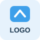

# Akesh Mallia Portfolio

Credit to Nisar Hassan for the template: https://github.com/nisarhassan12/portfolio-template


## Project tile years and organization logos

In `index.html`, find `<!-- Project 1 -->` through `<!-- Project 6 -->`.
Each tile contains a `PROJECT BADGE` comment followed by:

```html
<div class="project-tile__badge">
  <span class="project-tile__year">YYYY</span>
  
</div>
```

1. Replace `YYYY` with the project year or range, such as `2026` or `2025–2026`.
2. Upload your square PNG, SVG, or WebP logo to `images/logos/` on the same branch.
3. Replace `./images/logos/placeholder.svg` with its exact path, such as `./images/logos/rocket-lab.png`. Filenames are case-sensitive.
4. Replace the image's `alt` with the organization name, such as `Rocket Lab`.

| Tile | Project |
| --- | --- |
| 1 | High-Pressure Quick Disconnect |
| 2 | Northstar Rocket |
| 3 | Camp Randall Vibrations Research |
| 4 | NASA CubeSats |
| 5 | Hydraulic Test Fixture |
| 6 | ME 201 Crane |

All six years and logos start as placeholders. The same logo file can be reused on multiple tiles. Logos fit inside a 48-pixel white square without cropping. Badge styling is in the Project Tiles section of `index.css`. Keep the grayscale filter on `.project-tile__image`, not its wrapper, to preserve the badge colors.

Review changes on the feature branch before merging into the live `2026_07_08` branch.
